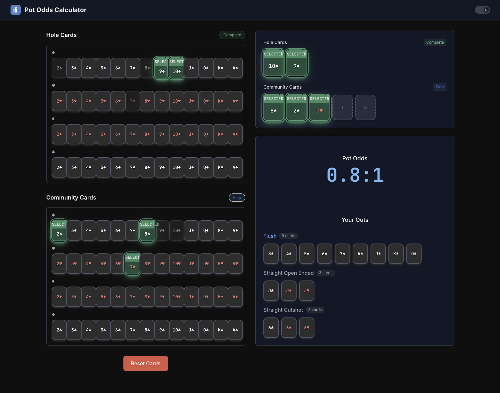

# Pot Odds Calculator

A professional poker pot odds calculator with real-time analysis and outs detection. Calculate your winning probabilities and make informed decisions at the poker table.



## Features

- 🎯 **Real-time Pot Odds Calculation** - Instant probability calculations using mathematical formulas
- 🃏 **Interactive Card Selection** - Easy-to-use interface for selecting hole cards and community cards
- 📊 **Outs Detection** - Automatically identifies all draw types including royal flush, straight flush, flush, straight, and pairs
- ⚡ **NUTS Detection** - Automatically identifies when you have an unbeatable hand
- 🚀 **High Performance** - Optimized backend using phevaluator for lightning-fast hand evaluation
- 🌓 **Dark/Light Mode** - Toggle between themes for comfortable viewing
- 📱 **Responsive Design** - Works seamlessly on desktop and mobile devices

## Quick Start

### Option 1: Using Docker (Recommended)

The easiest way to run the application is using the pre-built Docker image:

```bash
# Pull and run the latest image
docker pull stevenc81/pot-odds-app:latest
docker run -d -p 8080:80 --name pot-odds-app stevenc81/pot-odds-app:latest
```

Access the application at: **http://localhost:8080**

#### Managing the Container

```bash
# Check if it's running
docker ps

# View logs
docker logs pot-odds-app

# Stop the application
docker stop pot-odds-app

# Start it again
docker start pot-odds-app

# Remove the container
docker rm pot-odds-app
```

### Option 2: Using Docker Compose

For development or running multiple services separately:

```bash
# Start both frontend and backend services
docker-compose up -d

# Access at http://localhost:3000
```

#### Docker Compose Commands

```bash
# Start services
docker-compose up -d

# Stop services
docker-compose down

# View logs
docker-compose logs -f

# Rebuild after code changes
docker-compose up -d --build
```

## Development Setup

### Prerequisites

- Docker and Docker Compose installed
- Make (optional, for using Makefile commands)
- Git

### Clone the Repository

```bash
git clone https://github.com/stevenc81/pot-odds.git
cd pot-odds
```

### Using the Makefile

We provide a Makefile for common development tasks:

```bash
# Build all Docker images
make build

# Build and push to Docker Hub
make all

# Run locally for development
make dev

# Stop and clean up
make stop
make clean

# Show all available commands
make help
```

### Manual Development Setup

#### Backend Development

```bash
cd backend

# Using Docker
docker build -t pot-odds-backend .
docker run -p 8000:8000 pot-odds-backend

# Or using Python directly
uv venv
source .venv/bin/activate  # On Windows: .venv\Scripts\activate
uv sync
uvicorn main:app --reload --host 0.0.0.0 --port 8000
```

#### Frontend Development

```bash
cd frontend

# Using Docker
docker build -t pot-odds-frontend .
docker run -p 3000:3000 pot-odds-frontend

# Or using Node.js directly
npm install
npm run dev
```

### Development with Hot Reload

For active development with hot reload:

1. **Backend**: Use `uvicorn main:app --reload`
2. **Frontend**: Use `npm run dev`

Both will automatically reload when you make changes to the code.

## Architecture

### Technology Stack

**Backend:**
- FastAPI - Modern Python web framework
- phevaluator - Lightning-fast poker hand evaluation
- Python 3.11+
- uv - Fast Python package manager

**Frontend:**
- React 18 with TypeScript
- Vite - Fast build tool
- TailwindCSS - Utility-first CSS
- Zustand - State management
- React Query - Server state management

### Project Structure

```
pot-odds/
├── backend/                # FastAPI backend service
│   ├── main.py            # API endpoints
│   ├── poker_engine.py    # Core poker logic
│   ├── pot_odds_calculator.py  # Pot odds calculation with NUTS detection
│   ├── outs_detector.py   # Comprehensive outs detection
│   ├── models.py          # Pydantic models
│   ├── api-spec.md        # Detailed API specification
│   └── tests/             # Backend tests (110+ tests)
├── frontend/              # React frontend application
│   ├── src/
│   │   ├── components/    # React components
│   │   ├── hooks/         # Custom React hooks
│   │   ├── store/         # Zustand stores
│   │   └── utils/         # Utility functions
│   └── dist/              # Production build
├── demo/                  # Demo assets
│   └── screen.png         # Application screenshot
├── docker-compose.yml     # Multi-container setup
├── Dockerfile             # Single container setup
├── Makefile              # Build automation
└── CLAUDE.md             # AI assistant instructions
```

## API Documentation

Once the application is running, you can access:

- **API Documentation**: http://localhost:8000/docs
- **API Health Check**: http://localhost:8000/health

### Example API Request

```bash
curl -X POST http://localhost:8000/api/calculate \
  -H "Content-Type: application/json" \
  -d '{
    "hole_cards": ["Ah", "Kh"],
    "community_cards": ["Qh", "Jh", "Th"]
  }'

# Response:
{
  "pot_odds_ratio": "NUTS!",
  "outs": []
}
```

## Testing

### Backend Tests

```bash
cd backend
uv run pytest
uv run pytest --cov  # With coverage
```

### Frontend Tests

```bash
cd frontend
npm run type-check
npm run lint
```

## Deployment

### Using Pre-built Images

All images are available on Docker Hub:

- `stevenc81/pot-odds-app:latest` - Combined single container
- `stevenc81/pot-odds-backend:latest` - Backend only
- `stevenc81/pot-odds-frontend:latest` - Frontend only

### Building Your Own Images

```bash
# Build all images
make build

# Or individually
docker build -t my-pot-odds-app .
docker build -t my-backend backend/
docker build -t my-frontend frontend/
```

## Configuration

### Environment Variables

**Backend:**
- `PYTHONUNBUFFERED=1` - Ensures proper logging in Docker
- `PORT=8000` - API server port (default: 8000)

**Frontend:**
- `VITE_API_URL` - Backend API URL (default: `/api`)

### Nginx Configuration

The frontend uses Nginx to serve static files and proxy API requests. Configuration is in `frontend/nginx-docker.conf`.

## Troubleshooting

### Port Already in Use

If port 8080 is busy, use a different port:

```bash
docker run -d -p 3000:80 --name pot-odds-app stevenc81/pot-odds-app:latest
```

### Container Won't Start

Check logs for errors:

```bash
docker logs pot-odds-app
```

### API Not Responding

Verify backend is running:

```bash
curl http://localhost:8080/health
```

### Build Failures

Clear Docker cache and rebuild:

```bash
docker system prune -a
make clean
make build
```

## Contributing

1. Fork the repository
2. Create a feature branch (`git checkout -b feature/amazing-feature`)
3. Commit your changes (`git commit -m 'Add amazing feature'`)
4. Push to the branch (`git push origin feature/amazing-feature`)
5. Open a Pull Request

## License

This project is licensed under the MIT License - see the LICENSE file for details.

## Acknowledgments

- [phevaluator](https://github.com/HenryRLee/PokerHandEvaluator) for fast hand evaluation
- [FastAPI](https://fastapi.tiangolo.com/) for the excellent web framework
- [React](https://react.dev/) and [Vite](https://vitejs.dev/) for the frontend tooling
- [uv](https://github.com/astral-sh/uv) for fast Python package management

## Support

For issues, questions, or suggestions, please open an issue on GitHub.